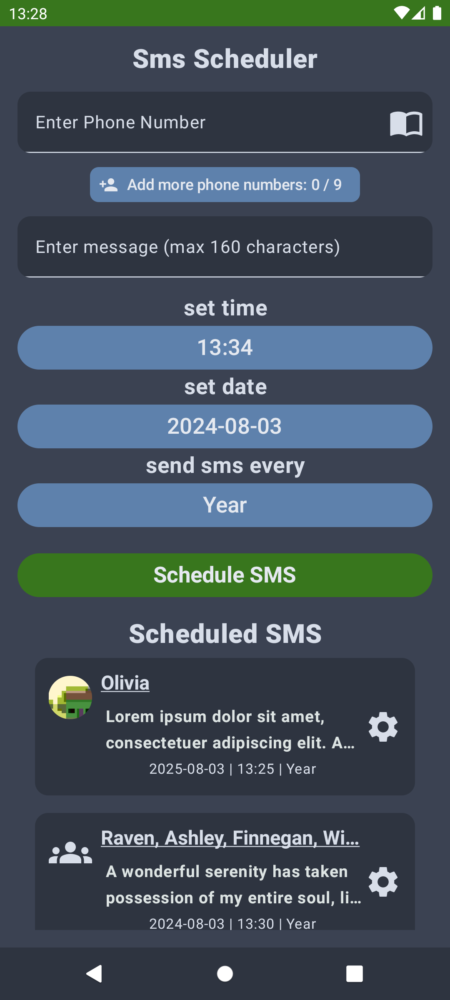
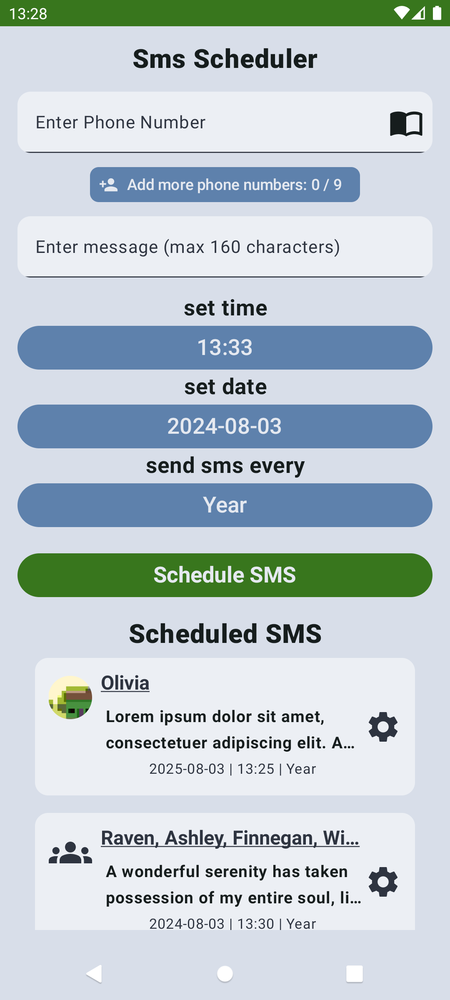

## Short Message Service

[Latest unstable APK here](https://github.com/DeluxerPanda/Short_Message_Service/blob/master/app/release/app-release.apk "Download latest unstable APK here")

##
<table>
<tr>
<td></td>
<td></td>
</tr>
</table>

\* There could be some issues. Please consider [submitting feedback](https://github.com/DeluxerPanda/Short_Message_Service/issues).

## Usage
- **SMS Scheduling**: Schedule your messages to be sent daily, weekly, monthly, or yearly
- **Contact Book Integration**: Quickly access and select numbers from your contact book
- **Multi-Number Messaging**: Send a single message to multiple contacts at once
- **Edit and Reschedule**: Plans changed? Easily edit your scheduled messages and adjust the sending time as needed.

